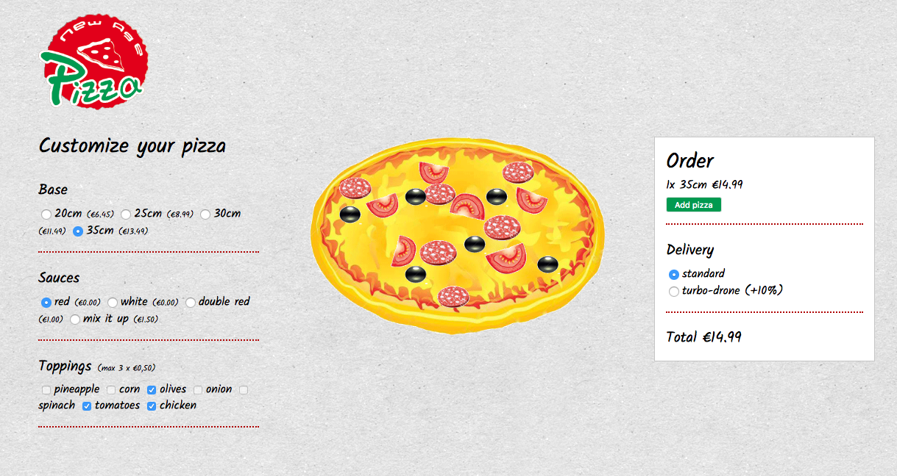

# Codaisseur homework assignment

During the weekend we had to build a pizza explorer with React and Redux.

Live version: https://martijnbartelson.github.io/homework-pizza-configurator/pizza

## Technologies used:
-React
-Redux
-Styled components

## Pizza Configurator Homework

Note: we’ll use the results of this homework assignment for a formal evaluation and as such you should write the code individually. Plagiarism is a violation of the Academy contract and makes nobody happy.
Intro

Forms are an important part of most real-world web apps. React enables you to make highly interactive forms that update predictably. One good use of forms is a configurator on which you pick a bunch of options and get you a price.

What better to configure then a pizza? We’re programmers after all, so let’s make dinner.

Send your homework to teachers@codaisseur.com before Sunday 20:00
Pizza Configurator

You’re asked to create a pizza configurator for NewAgePizza.com, a new and hip venture to get your pizza. It should be a single page that contains all the following elements.

-First you pick your base. You have four options:

   25cm NY Style € 8,99
   30cm NY Style € 11,49
   35cm NY Style € 13,49
   20cm NY Style € 6,45

-After that you pick your sauce options:

   White sauce
   Red sauce
   Double red sauce € 1,00
   Mix it up € 1,50

-After that you pick one or more toppings:

   Pineapple
   Corn
   Olives (green)
   Red union
   Spinach
   Cherry tomatoes
   Chicken

Rules: max. 3 toppings, toppings cost € 0,50 apiece

Last but not least, you can choose turbo-drone-delivery which is an additional 10% on top of the total pizza price.

Make sure you can change previous steps even if you already changed stuff before. So I could pick a base, a sauce and a topping and switch the base after that.

## Additional instructions:

   If any base is picked there should always be a price shown for the total pizza.
   The Redux store should contain the state of the pizza
   You don’t need any back end connection
   Make sure you split your app into separate components
   We expect you to use controlled form components as they are the best practice

Bonus points if you use Material-UI (v1)
